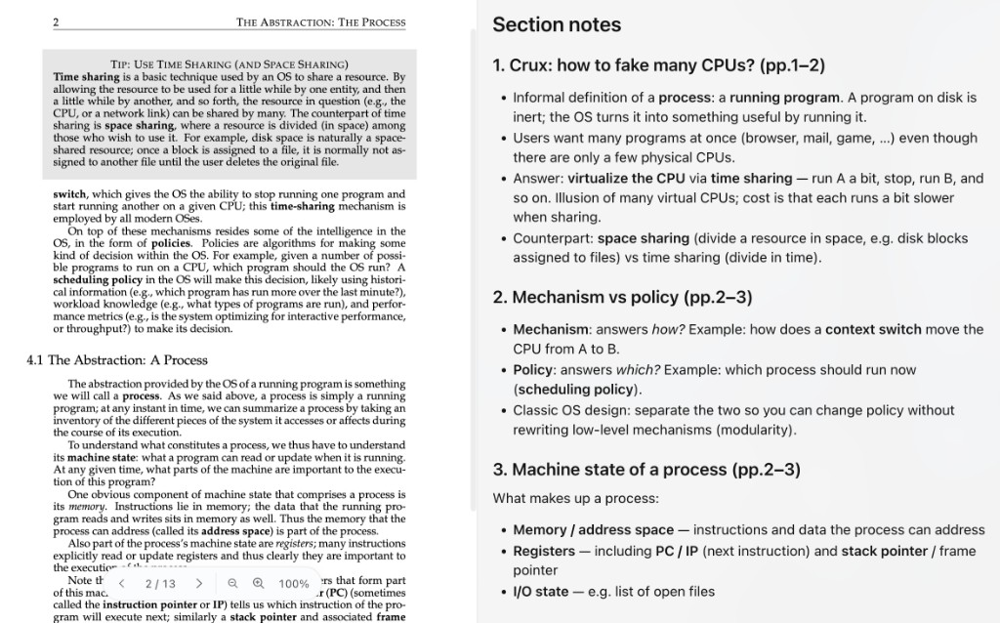

# course-notes

**把 Canvas / Ed 课件变成可复习的结构化笔记** — 给 Trae、Cursor 等 Agent Skill 宿主用。

[English README](README.md) · [示例笔记（OSTEP demo）](examples/demo/after-notes.md) · [MIT License](LICENSE)

不是又一个 PDF 摘要工具：它把「材料在哪 → 怎么取 → 图片怎么 OCR → 笔记什么格式 → 临时文件何时删」整条链路固化下来。装好后直接说 `wk7 总结`。

---

## 30 秒看懂

| 你给什么 | 你得到什么 |
|---|---|
| 一句 `INFO1112 wk5 总结`（或拖一个 PDF） | 总览 → 分部分（带页码）→ 对比表 → 速查 → 易混点 → 和作业的关联 |
| 纯示意图页 | 标注「此页为图，未读」，**不编造** |
| 临时 PDF / png | 读完即删，笔记只落在 `~/notes/` |

**Before → After**（真实 Tier 0：[OSTEP Ch.4](https://pages.cs.wisc.edu/~remzi/OSTEP/cpu-intro.pdf) — 左教材，右结构化笔记）：



完整笔记：[`examples/demo/after-notes.md`](examples/demo/after-notes.md) · 复现说明：[`examples/demo/`](examples/demo/)

## 四种模式

| 模式 | 触发说法 | 产出 |
|---|---|---|
| **summary** | `wk5 总结` / `总结 Lab 6` | 该周课件的结构化笔记 |
| **explain** | `explain <slide 链接>` | 逐页 / 逐 slide 详解 |
| **answer** | `回答每个问题并解释代码` | 逐题作答 + 代码逐行解释 |
| **quiz** | `出题考我` | 自测题 + 答案 |

## 上手（最多 3 步）

```
第 1 步（必须）装 skill  ──►  立刻可用：给个 PDF 就能出笔记
第 2 步（可选）配 token  ──►  能自动抓课件
第 3 步        直接说话  ──►  "INFO1112 wk5 总结"
```

| Tier | 你要做什么 | 能得到什么 |
|---|---|---|
| **Tier 0** 本地模式 | 只装 skill | 总结 / 讲解 / 答题 —— 材料自己给（拖 PDF、贴截图） |
| **Tier 1** 半自动 | 再配 Canvas **或** Ed 其中一个 token | 自动抓那一侧的材料 |
| **Tier 2** 全自动 | 两个 token 都配 | 课程自动发现 + 材料自动抓取 + 出笔记 |

**Tier 0 是真能用的**：结构化笔记、图片 OCR、临时文件清理全都不依赖 token。

### 第 1 步：装 skill（必须）

```bash
git clone https://github.com/OceanHu123/course-notes-skill.git ~/Projects/course-notes-skill
```

把仓库里的 `course-notes/` 目录接到你的 skills 路径（软链或复制均可）：

| 宿主 | Skills 目录 | 示例 |
|---|---|---|
| **Trae CN** | `~/.trae-cn/skills/` | `ln -s ~/Projects/course-notes-skill/course-notes ~/.trae-cn/skills/course-notes` |
| **Trae 国际版** | `~/.trae/skills/` | 同上，改路径 |
| **Cursor** | `~/.cursor/skills/`（或项目内 `.cursor/skills/`） | `ln -s ~/Projects/course-notes-skill/course-notes ~/.cursor/skills/course-notes` |
| **其他 Agent Skills 宿主** | 以该产品文档为准 | 目录内需有 `SKILL.md` |

```bash
# 方式一：软链接（改仓库即时生效）
ln -s ~/Projects/course-notes-skill/course-notes ~/.trae-cn/skills/course-notes

# 方式二：直接复制（最稳，和仓库解耦）
cp -R ~/Projects/course-notes-skill/course-notes ~/.trae-cn/skills/
```

装好后重启 IDE / Agent。`SKILL.md` 的 `description` 就是触发器。软链接没被识别就换方式二。

### 第 2 步（可选）：配 token

凭据**不放在 skill 里**（所以这个仓库可以公开），而是交给两个 MCP 服务器：

| 想要什么 | 需要什么 | 从哪拿 |
|---|---|---|
| Canvas 课表 / 课件 PDF | `CANVAS_API_URL` + `CANVAS_API_TOKEN` | Canvas → Account → Settings → **+ New Access Token**。URL 形如 `https://<你学校>.instructure.com/api/v1` |
| Ed lessons / slides | `ED_API_TOKEN` | 见 [ed-mcp](https://github.com/januarharianto/ed-mcp) 的 README |

两个服务器都是公开项目：

- Canvas → [vishalsachdev/canvas-mcp](https://github.com/vishalsachdev/canvas-mcp)
- Ed → [januarharianto/ed-mcp](https://github.com/januarharianto/ed-mcp)

各自把 token 写进自己仓库的 `.env`，然后在 IDE 里注册 MCP（Trae 示例：`~/Library/Application Support/Trae CN/User/mcp.json`）：

```json
{
  "mcpServers": {
    "canvas": { "command": "/绝对路径/run-canvas-mcp.sh", "args": [], "env": {} },
    "ed":     { "command": "/绝对路径/run-ed-mcp.sh",     "args": [], "env": {} }
  }
}
```

skill 默认去 `~/Projects/mcp/{canvas-mcp,ed-mcp}/.env` 读凭据；路径不一样就设 `MCP_DIR`，别改代码。

**验证配好了没**：

```bash
python3 ~/.trae-cn/skills/course-notes/scripts/check_env.py
```

（Cursor 用户把路径换成 `~/.cursor/skills/course-notes/...`。）

### 第 3 步：直接用

```
INFO1112 wk5 总结
wk7 总结
explain https://edstem.org/au/courses/36385/lessons/109426/slides/808037
出题考我 Week 5 的内容
```

笔记落到 `~/notes/<course-code>/<topic>.md`；`/tmp` 下临时文件用完即删。

## 依赖

| 用途 | 要求 |
|---|---|
| 读 PDF | `python3` + **PyMuPDF**（`import fitz`） |
| OCR 图片页 | **tesseract** → **macOS Vision** → 否则标注未读 |
| 自动取材料（可选） | Canvas / Ed MCP + token |

## 让它认识你的课程

**索引是缓存，不是前置条件。** 直接说课程代码；skill 在你账号的 Canvas / Ed 课表里匹配。

```bash
python3 ~/.trae-cn/skills/course-notes/scripts/discover_course.py <COURSE-CODE>
```

课程代码不含学校信息；学校由平台给出。匹配不到就明说，不编 id。

## 工作原理

```
check_env ──► 解析课程 ──► 找材料 ──► 抽文字 ──► OCR 图片页 ──► 写笔记 ──► 清理
```

1. **`scripts/check_env.py`**：Tier + 账号可见课程  
2. **`scripts/discover_course.py`**：课程代码 → 可粘贴索引  
3. **找材料**：Ed lessons API / Canvas module → `download_course_file`  
4. **`fetch_material.py`**：按页文字 + 图片页清单  
5. **`ocr_pages.py` / `ocr.swift`**：指定页 OCR  
6. **写笔记**：固定模板；中文讲解 + 英文术语；带页码  
7. **清理**：删 `/tmp` 一次性文件  

## 目录结构

```
course-notes-skill/
├── LICENSE
├── README.md              ← English (default)
├── README.zh-CN.md        ← 本文件
├── examples/demo/         ← OSTEP before/after（截图用）
└── course-notes/          ← 装进 skills/ 的目录
```

## 已知限制

- 只认你自己账号里的课  
- 纯示意图：标注未读，不编造  
- 扫描版 PDF：整本 OCR，慢且易错  
- Canvas 权限因课而异  
- Ed 需要 `User-Agent`（脚本已带）  

## License

[MIT](LICENSE)。Demo PDF 来自 OSTEP（不进 git）— https://pages.cs.wisc.edu/~remzi/OSTEP/
